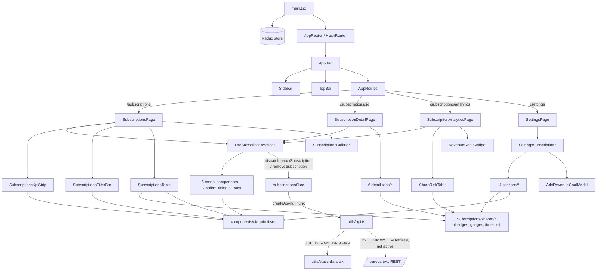

# PureCart Subscriptions — As-Built Frontend Architecture

**What this document is:** a complete reference for the code that actually exists in `src/app/`
today, written after building it — not a plan for what to build (that's files `00`–`08`). Where the
real implementation diverged from the plan (it did, in real ways), this document describes what's
actually there, not what was originally proposed. Read this when you need to know "what calls what"
or "where does X live" — read `00`–`08` when you need the *reasoning* behind a design choice.

**The 3 real deviations from the plan, upfront**, so nothing below is a surprise:
1. **State management is Redux Toolkit, not local `useState`.** A `subscriptionsSlice` already
   existed in this repo (committed before this build) with a documented decision to use it. The plan
   files still say "no global store" in places — that's now wrong, this document is correct.
2. **Routing is React Router (`HashRouter`), not a `useState<Page>` switch.** Also pre-existing
   infrastructure. Every page is a real, deep-linkable URL.
3. **Row actions and mutation modals live in one shared hook** (`useSubscriptionActions`), not
   duplicated per page. This wasn't in the original plan at all — it became necessary the moment a
   second page (Detail) needed the same ⋮ menu as the List page.

---

## 1. Tech stack, as built

| Concern | Real choice | Where |
|---|---|---|
| Framework | React 18 + TypeScript, strict mode | whole `src/app/` |
| State (subscription records) | Redux Toolkit — one slice, two thunks | `store/` |
| State (everything else: modals, toasts, filters-in-forms, settings) | Local `useState` per component | throughout |
| Routing | React Router v6, `HashRouter` (WP admin URL owns the real path; app routes live after `#`) | `router/` |
| Styling | Tailwind utility classes + inline `style={}` for M3 design tokens | throughout |
| Charts | Recharts | `Analytics/SubscriptionAnalyticsPage.tsx` only |
| Icons | `lucide-react` | throughout |
| Data source | 100% static/dummy, routed through one API-shaped abstraction layer | `utils/api.ts` |

No state management or routing library was *added* for this build — both were already installed and
scaffolded; this build filled them in and used them.

---

## 2. Boot sequence — literally how the app comes alive

```
index.html (WP-rendered page with <div id="purecart-react-dashboard-root">)
        │
        ▼
main.tsx
  createRoot(...).render(
    <Provider store={store}>          ← Redux store now available to every component via useAppSelector/useAppDispatch
      <AppRouter>                     ← wraps children in <HashRouter>
        <App />
      </AppRouter>
    </Provider>
  )
        │
        ▼
App.tsx
  - reads the current URL via useLocation()
  - derives `page: Page` from the pathname via getPageFromPath() (router/paths.ts)
  - renders <Sidebar>, <TopBar>, and <AppRoutes /> inside a flex layout
        │
        ▼
AppRoutes.tsx (router/)
  - matches the URL against 5 <Route> entries
  - renders exactly one top-level page component
        │
        ▼
Whichever page component matched:
  - SubscriptionsPage | SubscriptionDetailPage | SubscriptionAnalyticsPage | SettingsPage
  - each of the first 3 immediately dispatches loadSubscriptions() if the Redux store is still empty
        │
        ▼
loadSubscriptions() thunk (store/slices/subscriptionsSlice.ts)
  - calls fetchSubscriptions() (utils/api.ts)
  - api.ts currently resolves from static-data.tsx after an artificial delay (USE_DUMMY_DATA = true)
  - store.items populates → every page watching useAppSelector(s => s.subscriptions.items) re-renders
```

From here on, every user interaction is: **click → local UI state changes (which modal is open) or a
Redux action dispatches (data changes) → React re-renders the affected components.** There is no
other data path in the app.

---

## 3. The complete file tree, annotated

```
src/app/
├── main.tsx                              Boots Redux Provider + AppRouter + App
├── App.tsx                               Reads route → renders Sidebar/TopBar/AppRoutes; computes
│                                          the Detail page's dynamic title from the URL + store
│
├── router/
│   ├── AppRouter.tsx                     <HashRouter> wrapper
│   ├── AppRoutes.tsx                     The 5 <Route> definitions
│   ├── paths.ts                          PAGE_PATHS, SUBSCRIPTION_DETAIL_PATH,
│   │                                     subscriptionDetailPath(id), getPageFromPath()
│   └── index.ts                          Barrel
│
├── store/
│   ├── store.ts                          configureStore({ subscriptions: subscriptionsReducer })
│   ├── hooks.ts                          useAppDispatch, useAppSelector (typed)
│   └── slices/
│       └── subscriptionsSlice.ts         THE state: items, status, error, selectedId, filters.
│                                          2 thunks (loadSubscriptions, patchSubscription), 9 sync actions
│
├── utils/
│   ├── subscription-types.ts             Every TS interface (SubscriptionRecord, the 6-way
│   │                                     linkedEntity union, PaymentRecord, RetentionOffer,
│   │                                     SubscriptionSettings, etc.) — the one source of truth
│   │                                     for field names/shapes across the whole app
│   ├── static-data.tsx                   M3 tokens, NAV_SCHEMA, PAGE_TITLES, Page type, and every
│   │                                     sample dataset (18 subscriptions, payment history, churn
│   │                                     risk, revenue goals, cancellation reasons, settings
│   │                                     defaults, chart datasets)
│   ├── api.ts                            The dummy API layer — 8 functions, one USE_DUMMY_DATA flag
│   └── subscription-metrics.ts           Pure calculation helpers (computeMRR, addBillingInterval,
│                                         computeChurnRatePct, computeAvgLtv, etc.) — shared so the
│                                         List page's KPI strip and the Analytics page never
│                                         disagree on a formula
│
├── components/
│   ├── ui/                               21 generic, domain-agnostic primitives (buttons, Card,
│   │                                     StatusBadge, FilterChip, ActionDropdown, ConfirmDialog,
│   │                                     Toast, Toggle, StatCard, KpiCard, Sidebar, TopBar, ...)
│   │
│   ├── Subscriptions/
│   │   ├── useSubscriptionActions.tsx    ★ THE shared hook — every row action, every mutation
│   │   │                                 modal, toast, and confirm-dialog. List page and Detail
│   │   │                                 page both call this and get identical behavior.
│   │   ├── SubscriptionsPage.tsx         List page orchestrator
│   │   ├── SubscriptionsKpiStrip.tsx     6-card KPI strip (dumb, reads props only)
│   │   ├── SubscriptionsFilterBar.tsx    Search + 6 filter chips (dumb, controlled)
│   │   ├── SubscriptionsTable.tsx        The 13-column table (dumb, controlled)
│   │   ├── SubscriptionsBulkBar.tsx      Floating bulk-action bar (dumb, controlled)
│   │   ├── SubscriptionDetailPage.tsx    Detail page orchestrator
│   │   ├── detail-tabs/                  6 tab components the Detail page switches between
│   │   ├── modals/                       5 modal components + subscriptionDialogs.ts (4 config
│   │   │                                 builders for the simplest popups)
│   │   └── shared/                       15 components used by 2+ of the pages above (badges,
│   │                                     gauges, timeline, and — after a mid-build reorganization —
│   │                                     the 5 Settings* form-field components too)
│   │
│   ├── Analytics/
│   │   ├── SubscriptionAnalyticsPage.tsx Analytics page orchestrator
│   │   ├── ChurnRiskTable.tsx            Extended churn table (dumb, controlled)
│   │   └── RevenueGoalsWidget.tsx        Read-only goal cards
│   │
│   └── Settings/
│       ├── SettingsPage.tsx              Top-level container (1 tab: "Subscriptions")
│       ├── SettingsSubscriptions.tsx     Owns the settings object + all 14 sections
│       ├── CollapsibleSection.tsx        Accordion wrapper
│       ├── AddRevenueGoalModal.tsx       4-field "create a goal" modal
│       ├── settingsSectionTypes.ts       Shared prop type + CSV<->number[] helpers
│       └── sections/                    14 section components (10 always-visible, 4 conditional)
│
└── styles/                               Tailwind + font CSS, untouched by this build
```

---

## 4. State & data layer, in detail

### 4.1 `subscriptionsSlice.ts` — the one Redux slice

```ts
interface SubscriptionsState {
	items: SubscriptionRecord[];
	status: 'idle' | 'loading' | 'succeeded' | 'failed';
	error: string | null;
	selectedId: string | null;      // set when navigating list → detail; not required for the route to work
	filters: {
		search, status, product, cycle, deliveryType, paymentType, churnRisk  // all strings, 'All' = no filter
	};
}
```

- **`loadSubscriptions`** (`createAsyncThunk`) — calls `api.fetchSubscriptions()`. Every page that
  shows subscription data dispatches this on mount if `status === 'idle'`, so the store populates no
  matter which page the user lands on first (deep links work).
- **`patchSubscription`** (`createAsyncThunk`) — calls `api.updateSubscription(id, patch)`, then
  merges the *returned* record back into `items` on success. Every mutation in the app — pause,
  cancel, apply discount, reset a license's activations, anything — goes through this one thunk via
  `useSubscriptionActions`'s `updateRow(id, patch)` wrapper. There is no second way to change a
  subscription's data.
- 9 synchronous reducers: `setSelectedSubscriptionId`, `removeSubscription` (Delete Record — no
  backend endpoint exists for this yet, so it's local-only), and one setter per filter field plus
  `clearFilters`.

### 4.2 `utils/api.ts` — the dummy API layer

8 exported async functions, each shaped like its eventual real REST call:
`fetchSubscriptions`, `fetchSubscription(id)`, `updateSubscription(id, patch)`,
`fetchSubscriptionLogs(id)`, `fetchSubscriptionEmails(id)`, `fetchPaymentHistory(id)`,
`fetchRevenueGoals()`, `fetchChurnRisk()`.

One constant controls everything: `const USE_DUMMY_DATA = true`. While true, every function resolves
from `static-data.tsx` after a small artificial delay (so loading states are real, not instant).
Flip it to `false` and every function instead calls `apiFetch()`, which hits
`${API_BASE}${path}` with the `X-WP-Nonce` header already wired to `window.purecartConfig`.
**This is the single switch that makes the whole app go live** — no component anywhere calls
`fetch()` or imports `static-data.tsx`'s arrays directly for anything that has a function here.

### 4.3 `subscription-metrics.ts` — shared math

`computeMRR`, `addBillingInterval`, `isCancelledThisMonth`, `countNewThisMonth`,
`computeChurnRatePct`, `computeAvgLtv`, `formatCurrency`. Both `SubscriptionsKpiStrip` (List page) and
`SubscriptionAnalyticsPage` import from here — neither has its own copy of "how do I compute MRR."

### 4.4 `subscription-types.ts` / `static-data.tsx`

Types file has zero runtime code — pure interfaces, imported with `import type` everywhere. Data file
has the M3 design-token object, `Page` type, `NAV_SCHEMA`/`PAGE_TITLES` (read by `Sidebar`/`TopBar`),
18 sample `SubscriptionRecord`s (covering all 6 delivery types and all 10 statuses), and every other
static dataset (payment history, cancellation reasons, chart data, settings defaults).

---

## 5. Routing layer

```ts
// paths.ts
PAGE_PATHS = {
  subscriptions: '/subscriptions',
  'subscription-analytics': '/subscriptions/analytics',
  'subscription-detail': '/subscriptions',   // placeholder — see SUBSCRIPTION_DETAIL_PATH below
  settings: '/settings',
}
SUBSCRIPTION_DETAIL_PATH = '/subscriptions/:id'
subscriptionDetailPath(id) => `/subscriptions/${id}`
getPageFromPath(pathname) => matches exact paths first, falls back to prefix-matching
                              '/subscriptions/*' as 'subscription-detail'
```

```tsx
// AppRoutes.tsx
<Routes>
  <Route path="/" element={<Navigate to="/subscriptions" replace />} />
  <Route path="/subscriptions" element={<SubscriptionsPage />} />
  <Route path="/subscriptions/:id" element={<SubscriptionDetailPage />} />
  <Route path="/subscriptions/analytics" element={<SubscriptionAnalyticsPage />} />
  <Route path="/settings" element={<SettingsPage />} />
</Routes>
```

React Router v6 ranks the static `/subscriptions/analytics` segment above the dynamic
`/subscriptions/:id` automatically, so declaration order doesn't matter — a URL for the analytics
page can never be swallowed by the detail-page route.

`App.tsx` is the only place that calls `getPageFromPath()` — it uses the result for 3 things: which
`Sidebar` item highlights, what `TopBar` shows as breadcrumb/title, and (for the Detail page
specifically) looking up the live record from the store to build a dynamic title like
`"SUB-003 · SaaS Starter"` instead of a generic static one.

---

## 6. The central piece: `useSubscriptionActions()`

This hook is the one thing every "mutate a subscription" interaction in the entire app goes through.
Both `SubscriptionsPage` and `SubscriptionDetailPage` (and `SubscriptionAnalyticsPage`, for its churn
table) call it and get back:

```ts
{
	rowActions: (row) => ActionItem[],   // the full ⋮ menu for one row — universal groups + the
	                                      // delivery-type-specific group, built fresh per row
	openPaymentHistory: (row) => void,   // fetches payments, opens PaymentHistoryModal
	openBulkDiscount: (rows[]) => void,  // opens ApplyDiscountModal in bulk mode
	sendCardUpdateEmail: (row) => void,  // opens the Send-Card-Update confirm
	openCancelFlow: (row) => void,       // = setCancelRow — opens CancellationFlowModal directly
	openPauseModal: (row) => void,       // = setPauseRow — opens PauseDurationModal directly
	openChangePlan: (row) => void,       // = setPlanRow
	showToast, openDialog, closeDialog,  // primitives for page-specific one-off confirms
	updateRow, deleteRow,                // the dispatch(patchSubscription(...)) / dispatch(removeSubscription(...)) wrappers
	modals: <JSX.Element>,               // ALL of the conditional modals + the shared ConfirmDialog
	                                      // + Toast, pre-wired — render this once, at the bottom of the page
}
```

Internally it owns: toast state, one `ConfirmDialog` config state, and one row-reference state per
modal (`cancelRow`, `pauseRow`, `planRow`, `discountRow`/`discountBulkRows`, `historyRow`/
`historyPayments`). None of that state is shared between pages — each page that calls the hook gets
its **own** independent instance (it's a hook, not a singleton), so opening a modal on the List page
has no effect on the Detail page's state. What *is* shared is the *behavior* — the exact same
`rowActions()` logic, the exact same modal components, the exact same effects on the Redux store.

```
                    ┌─────────────────────────┐
                    │  useSubscriptionActions  │
                    │  (called independently   │
                    │   by each page below)     │
                    └────────────┬─────────────┘
             ┌───────────────────┼───────────────────┐
             ▼                   ▼                   ▼
  SubscriptionsPage   SubscriptionDetailPage   SubscriptionAnalyticsPage
  (full rowActions     (rowActions in the ⋮      (only openDialog/
   menu per row +       menu + direct Pause/       openBulkDiscount/
   bulk bar actions)    Cancel header buttons)      updateRow, for its
                                                      churn table)
```

---

## 7. UI primitives (`components/ui/`) — 21 files, all domain-agnostic

| Component | What it does |
|---|---|
| `Card` | Rounded surface wrapper, base for nearly every other panel |
| `FilledButton` / `OutlinedButton` / `TonalButton` / `TextButton` | The 4 M3 button weights, all support `danger`/`small`/`disabled` |
| `IconButton` | Circular icon-only button |
| `StatusBadge` | Colored pill for a status string — knows all 10 subscription statuses plus a few license-era ones (`revoked`, `pending`) |
| `FilterChip` | Dropdown chip used by the filter bar |
| `ActionDropdown` | The ⋮ menu component — takes an `ActionItem[]` built by whoever calls it (never builds its own list) |
| `ConfirmDialog` | The one shared "are you sure?" modal — every "Kind A" popup in the app is this component with different props |
| `Toast` | Bottom-center notification |
| `Toggle` | The actual on/off switch — everything else that looks like a toggle (`SettingsToggleField`) composes this, nothing reimplements it |
| `StatCard` | Compact metric card (accent bar + value + label) — used by the List page's KPI strip |
| `KpiCard` | Heavier metric card (icon + trend chip) — used by the Analytics page |
| `TrendChip`, `SectionTitle` | Small supporting primitives |
| `Sidebar` | Reads `NAV_SCHEMA` directly from `static-data.tsx` — no props carry the nav item list, only `activePage`/`onNav`/`collapsed`/`onToggle` |
| `TopBar` | Reads `PAGE_TITLES`; special-cases breadcrumbs for `subscription-analytics` and `subscription-detail`; accepts an optional `detailLabel` override |
| `index.ts` | Barrel — every page imports primitives from here, never from individual files |

---

## 8. Subscription-domain shared components (`Subscriptions/shared/`) — 15 files

Split into two groups by what they depend on:

**Pure display, read a value, render a badge/graphic** (used by List, Detail, and/or Analytics):
`SubscriptionTypeBadge`, `ChurnScoreBadge` (+ exports `getChurnZone`/`CHURN_ZONE_COLORS` so the List
page's Churn Risk filter uses the *exact* same band boundaries), `ChurnGauge`, `InstallmentProgress`,
`CardExpiryWarning`, `SubscriptionTimeline`, `RevenueGoalCard`.

**Modal building blocks** (used only by `CancellationFlowModal`): `StepIndicator`,
`CancellationReasonList`, `RetentionOfferCard`.

**Settings form fields** (used only by `Settings/sections/*`, moved here from `ui/` mid-build once it
was clear they're scoped to one feature, not generic): `SettingsField`, `SettingsSelectField`,
`SettingsToggleField` (composes `ui/Toggle`), `SettingsTextareaField`, `SettingsSectionHeader`.

---

## 9. List Page

```
SubscriptionsPage.tsx  (orchestrator — owns: selected[] for bulk checkboxes, calls useSubscriptionActions())
  │
  ├─ SubscriptionsKpiStrip     ← props: data (full unfiltered array)
  ├─ SubscriptionsFilterBar    ← props: all 6 filter values + setters (dispatch-wrapped), product/cycle option lists
  ├─ SubscriptionsTable        ← props: filtered rows, selection state, rowActions fn, onViewDetail, onCardExpiryClick
  ├─ SubscriptionsBulkBar      ← props: selection count, one callback per bulk action
  └─ { modals }                ← from the hook — every mutation popup
```

Filtering happens in `SubscriptionsPage` itself (a `.filter()` over `tableData` read from
`filters` in the Redux store) — the 4 child components never filter anything, they only render what
they're given. Clicking a table row's ID calls `onViewDetail(id)`, which dispatches
`setSelectedSubscriptionId` and navigates to `subscriptionDetailPath(id)`.

---

## 10. Modals (`Subscriptions/modals/`)

| File | Kind | Notes |
|---|---|---|
| `CancellationFlowModal.tsx` | Real modal, own state | 3 steps: reason → offer (skipped if none) → timing. Accepting an offer aborts the cancellation and calls `onOfferAccepted`, which `useSubscriptionActions` translates into the right patch per offer type |
| `PauseDurationModal.tsx` | Real modal, own state | 1/2/3 months or indefinite |
| `ChangePlanModal.tsx` | Real modal, own state | Extracted from the original inline JSX; added the immediate-vs-scheduled timing toggle |
| `ApplyDiscountModal.tsx` | Real modal, own state | Extracted; added bulk mode via an optional `bulkRows` prop |
| `PaymentHistoryModal.tsx` | Real modal, no state | Read-only table |
| `subscriptionDialogs.ts` | 4 plain functions, not components | `buildEarlyRenewalDialog`, `buildSkipCycleDialog`, `buildScaReauthDialog`, `buildSendCardUpdateDialog` — each returns a config object fed straight into the shared `ConfirmDialog` via `openDialog()`. No dedicated component exists for these because their entire content is "icon + title + body + one button," which `ConfirmDialog` already renders |

All 5 real modals, plus the shared `ConfirmDialog`/`Toast`, are assembled into one `modals` JSX
fragment inside `useSubscriptionActions` — no page builds this list itself.

---

## 11. Detail Page

```
SubscriptionDetailPage.tsx
  - useParams() → id → looks up the row from the Redux store
  - dispatches loadSubscriptions() if store is empty (deep-link support)
  - fetches logs/emails/payments for this one id via api.ts, on mount
  - calls useSubscriptionActions() for its header buttons + ⋮ menu + modals
  │
  ├─ Header: back link, StatusBadge, Pause/Cancel buttons (→ openPauseModal/openCancelFlow),
  │          ActionDropdown (→ rowActions(row))
  ├─ Tab bar: Overview | {type label} | Payment Log | Status History | Emails Sent | Retention
  └─ Tab content, one of:
       OverviewTab           ← row, onSendCardUpdate
       DeliveryTypeTab       ← row, showToast/openDialog/closeDialog/updateRow (from the hook)
       PaymentLogTab         ← row, payments[]
       StatusHistoryTab      ← events[] (sorted newest-first, via SubscriptionTimeline)
       EmailsSentTab         ← emails[]
       RetentionTab          ← row, events[] (filtered to retention-related entries)
```

`DeliveryTypeTab` is the one tab that needs to *mutate* data (Revoke License, Reset Activations,
etc.), so it receives the hook's primitives directly rather than a single callback — same pattern the
row-actions builder uses internally, just exposed one level up.

---

## 12. Analytics Page

```
SubscriptionAnalyticsPage.tsx
  - useAppSelector → subscriptions (for the 8 KPI calculations, via subscription-metrics.ts)
  - fetches goals + churnRisk via api.ts on mount (local useState, not Redux — no other page reads these)
  - calls useSubscriptionActions() for the churn table's row actions
  │
  ├─ 8 × KpiCard              ← computed live from real store data
  ├─ 5 × Recharts chart       ← MRR/ARR/NRR line, type-mix pie, revenue-by-type bar,
  │                              dunning-funnel bar, churn-by-reason pie (all from static-data.tsx —
  │                              no REST endpoint documented yet for these 5 datasets)
  ├─ RevenueGoalsWidget       ← read-only RevenueGoalCards (no onDelete passed)
  └─ ChurnRiskTable           ← entries[], 3 action callbacks wired to the shared hook
```

---

## 13. Settings Page

```
SettingsPage.tsx                    (1 tab: "Subscriptions" — no other module exists in this repo)
  └─ SettingsSubscriptions.tsx       (owns: SubscriptionSettings object, isDirty flag, goals[])
       ├─ CollapsibleSection × 14    (accordion wrapper, one per section)
       │    ├─ SubGeneralSection             ┐
       │    ├─ SubBillingDunningSection      │
       │    ├─ SubRenewalsSection            │  all take { settings, update } and render
       │    ├─ SubUpgradeDowngradeSection     │  Settings* fields from Subscriptions/shared/
       │    ├─ SubRetentionSection            │
       │    ├─ SubCustomerPortalSection       │
       │    ├─ SubRoleMappingSection          │
       │    ├─ SubSubscribeSaveSection        │
       │    ├─ SubAdvancedSection            ┘
       │    ├─ SubRevenueGoalsSection    ← different shape: { goals, onAdd, onDelete }, opens
       │    │                              AddRevenueGoalModal itself
       │    ├─ SubMembershipSection      ┐  conditional — CollapsibleSection only renders when
       │    ├─ SubDownloadsSection        │  hasType(deliveryType) finds a matching sample row
       │    ├─ SubCoursesSection          │  in the Redux store (falls back to static-data.tsx
       │    └─ SubServiceSection         ┘  if the store hasn't loaded yet)
       └─ Save Changes button            (disabled until isDirty; click → toast only, no persistence)
```

Settings state is **not** in Redux — it's local to `SettingsSubscriptions`. Nothing else in the app
currently reads a setting value, so there was nothing to share yet; if a future page needs to read
settings (e.g. the List page respecting `allowSelfCancel`), that's the trigger to promote this into
its own slice, not before.

---

## 14. Full connection map



---

## 15. Two full traces, start to end

### Trace A — admin pauses a subscription from the List page

1. `SubscriptionsPage` renders; `useSubscriptionActions()` gave it a `rowActions` function.
2. Admin clicks ⋮ on a row → `ActionDropdown` shows the menu built by `rowActions(row)`.
3. Admin clicks "Pause Subscription" → that `ActionItem`'s `onClick` is `() => setPauseRow(row)` —
   state internal to the hook, in the *List page's* instance of it.
4. `pauseRow` becomes non-null → the hook's `modals` JSX renders `<PauseDurationModal row={pauseRow} ... />`.
5. Admin picks "2 months," clicks "Pause Subscription" inside the modal → its `onPause(pauseEndDate)`
   callback runs, which calls `updateRow(pauseRow.id, { status: 'paused', nextPayment: null, pauseEndDate })`.
6. `updateRow` dispatches `patchSubscription({ id, patch })` → the thunk calls
   `api.updateSubscription(id, patch)` → (dummy mode) mutates an in-memory copy and resolves after
   ~200ms → the thunk's `fulfilled` reducer merges the returned record into `state.items`.
7. `SubscriptionsPage`'s `useAppSelector(s => s.subscriptions.items)` sees the new array reference →
   re-renders → `SubscriptionsTable` shows the row as `paused` — no manual refresh, no local state to
   reconcile.
8. `showToast(...)` fires; the shared `Toast` (rendered inside `modals`) shows it for 3 seconds.

### Trace B — admin deep-links straight to `/subscriptions/SUB-003`

1. Browser loads the URL directly (or the admin pastes/bookmarks it). `main.tsx` boots exactly the
   same way regardless of the starting URL.
2. `App.tsx` calls `getPageFromPath('/subscriptions/SUB-003')` → matches the
   `/subscriptions/{anything}` prefix → returns `'subscription-detail'`.
3. `AppRoutes` matches `SUBSCRIPTION_DETAIL_PATH` (`/subscriptions/:id`) → renders
   `<SubscriptionDetailPage />`.
4. `SubscriptionDetailPage` reads `id = 'SUB-003'` via `useParams()`. The Redux store is still
   `status: 'idle'` (nothing loaded it yet) → its own `useEffect` dispatches `loadSubscriptions()`.
5. While loading, it renders the "Loading subscription…" state. Once `loadSubscriptions` resolves,
   `tableData.find(r => r.id === 'SUB-003')` finds the row and the real page renders.
6. Separately, `App.tsx` is *also* watching the store for this same id (to build the TopBar's
   dynamic title) — it re-renders once the store populates too, so the breadcrumb goes from the
   generic "Subscription Detail" to "SUB-003 · SaaS Starter" the moment data arrives.
7. If `id` doesn't match any record after loading finishes, the page renders its "Subscription not
   found" empty state with a link back to the list — never a crash.

---

## 16. Honest gaps (things that look built but aren't fully real)

- **Nothing persists.** Every mutation lives only in the Redux store's in-memory state for this
  browser session. Reload the page and everything reverts to `static-data.tsx`'s defaults. This is
  intentional — flip `USE_DUMMY_DATA` in `api.ts` to change it.
- **`DeliveryTypeTab`'s "not built yet" notices are real**, not placeholder text left by mistake:
  per-download logs, deliverable logs, SaaS user lists, and membership tier-history genuinely have no
  backing data type anywhere in this codebase.
- **Settings' Role Mapping dropdowns** list 4 hardcoded roles — there's no WP roles source available
  to a frontend-only build.
- **Analytics chart-segment clicks don't filter anything** — no cross-page filter-intent plumbing was
  built; clicking a pie slice does nothing.
- **Bundle size**: `npm run build` emits a performance warning (~616 KiB JS) once Recharts entered
  the graph. Not an error, but a real candidate for a lazy-loading pass on the Analytics route later.
